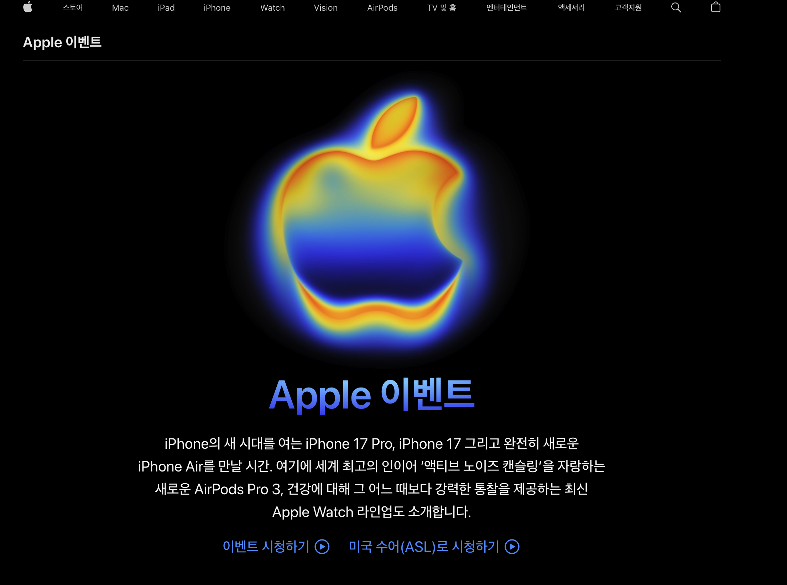
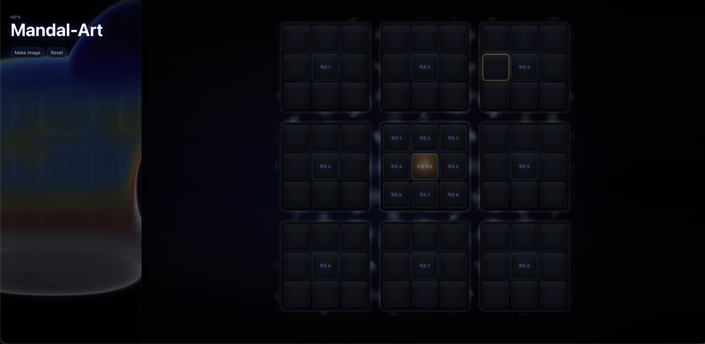

# ou-mandal-art

`docs/ref.png`(Apple 이벤트 키비주얼)의 열화상 무드를 가져온 9x9 만다라트 웹.

| 레퍼런스 (`docs/ref.png`) | 결과물 (`docs/main-page.png`) |
| --- | --- |
|  |  |

## 만든 방식

전부 AI 코딩 에이전트로 작성.

- **Codex (GPT-5.5)** — 초기 스캐폴딩, Three.js / WebGL 셰이더 기반 열화상 백그라운드 프로토타입
- **Claude Code (Opus 4.7)** — 9x9 만다라트 그리드, 컴포넌트 분리·리팩터링, Canvas 2D heat field 재구현, 디자인 다듬기

`docs/ref.png` 한 장을 레퍼런스로 주고 두 에이전트가 번갈아 디자인·구조·인터랙션을 작성.

## 스택

- Vite + React 19 + TypeScript
- Three.js · Canvas 2D heat field
- framer-motion, html-to-image (PNG export)
- localStorage 자동 저장

## 실행

```bash
pnpm install
pnpm dev
```

## 문서

- [docs/mandal-art.md](docs/mandal-art.md) — 디자인·구현 명세
- `docs/ref.png`, `docs/ref.gif` — 레퍼런스
